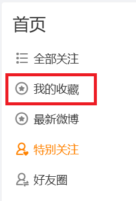
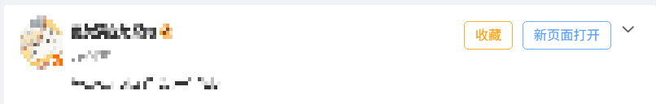

# weibo-favorites-userscript

微博（weibo.com）收藏功能增强的油猴（Tampermonkey）用户脚本。

## 功能

- ✅ **左侧菜单入口**：在左侧菜单「最新微博」条目前插入「我的收藏」入口，点击直达 `weibo.com/u/favorites` 收藏页
- ✅ **帖子一键收藏**：为每条帖子添加「收藏/取消收藏」按钮，适用于首页、收藏页、个人主页等全部页面
- ✅ **新页面打开**：每条帖子附带「新页面打开」按钮，一键在新标签页打开该帖 permalink
- ✅ 按钮注入在帖子头部操作条，不依赖特定页面容器结构，SPA 路由切换、虚拟列表均正常工作
- ✅ 收藏状态本地缓存 1 小时，避免重复请求
- ✅ 纯本地运行：仅调用微博官方接口，不收集任何数据

## 截图

左侧菜单新增的「我的收藏」入口（位于「最新微博」上方）：

帖子头部的「收藏」与「新页面打开」按钮：

## 安装

1. 浏览器安装 [Tampermonkey](https://www.tampermonkey.net/)
2. 通过以下任一方式安装本脚本：
   - **一键安装（推荐）**：[从 Release 安装最新版](https://github.com/wuzh07/weibo-favorites-userscript/releases/latest/download/weibo-favorites.user.js)，Tampermonkey 会自动弹出安装页
   - [**从 Greasy Fork 安装**](https://greasyfork.org/zh-CN/scripts/598928-%E5%BE%AE%E5%8D%9A%E6%94%B6%E8%97%8F%E5%A2%9E%E5%BC%BA)
   - **手动安装**：新建脚本，粘贴 `weibo-favorites.user.js` 内容保存
3. 打开 https://weibo.com ，左侧菜单即可看到「我的收藏」，每条帖子头部会出现「收藏」和「新页面打开」按钮

## 兼容性

| 浏览器 | 支持 |
|---|---|
| Chrome / Edge (Tampermonkey) | ✅ |
| Firefox (Tampermonkey) | ✅ |
| 油猴 (Safari) | 理论支持，未测试 |

## 反馈

如有问题或建议，请到 [GitHub Issues](https://github.com/wuzh07/weibo-favorites-userscript/issues) 反馈。

## 致谢

- 帖子一键收藏功能的按钮位置与交互方式参考了 [Fat Cabbage 的「微博帖子一键收藏、屏蔽、新页面打开」](https://greasyfork.org/zh-CN/scripts/461454)（MIT），感谢其开源贡献。

## 许可

MIT
